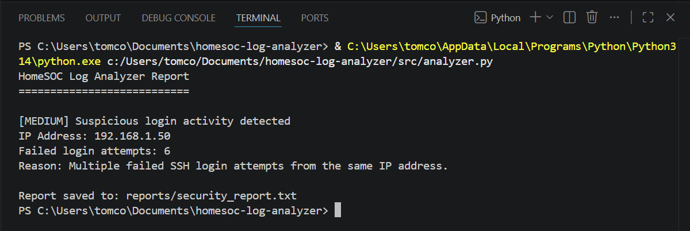

# HomeSOC Log Analyzer

HomeSOC Log Analyzer is a beginner-friendly Python cybersecurity project that analyzes SSH authentication logs and detects suspicious login behaviour.

## Project overview

This tool reads a Linux-style authentication log file and identifies IP addresses with repeated failed login attempts. It then assigns a basic risk level and generates a security report.

The project was built to practise practical blue-team cybersecurity skills, including log analysis, detection logic, risk scoring, and incident-style reporting.

## Current features

* Reads a sample SSH authentication log
* Allows the user to choose a specific log file to analyze
* Detects repeated failed login attempts
* Extracts source IP addresses
* Counts failed login attempts by IP
* Assigns a risk level
* Prints findings to the terminal
* Saves a report to `reports/security_report.txt`

## Detection logic

The tool currently flags an IP address as suspicious when it has 5 or more failed SSH login attempts.

Risk levels:

* 5-9 failed attempts: MEDIUM
* 10+ failed attempts: HIGH

## Example output

```text
HomeSOC Log Analyzer Report
===========================
Log file analyzed: data/sample_auth.log

[MEDIUM] Suspicious login activity detected
IP Address: 192.168.1.50
Failed login attempts: 6
Reason: Multiple failed SSH login attempts from the same IP address.

Report saved to: reports/security_report.txt
```

## Screenshot



## How to run

To analyze the default sample log file, run:

```bash
py src/analyzer.py
```

To choose a specific log file, run:

```bash
py src/analyzer.py data/sample_auth.log
```

## Project structure

```text
homesoc-log-analyzer/
├── data/
│   └── sample_auth.log
├── reports/
│   └── security_report.txt
├── screenshots/
│   └── example-output.png
├── src/
│   └── analyzer.py
├── .gitignore
├── README.md
└── requirements.txt
```

## Skills demonstrated

* Python scripting
* Log parsing
* Regular expressions
* Basic detection engineering
* Security event analysis
* Risk scoring
* Report generation
* Command-line input handling

## What I learned

While building this project, I practised:

* Reading and parsing log files with Python
* Using regular expressions to extract IP addresses
* Counting repeated security events
* Applying simple detection logic
* Assigning risk levels to findings
* Generating a basic security report
* Allowing users to provide a custom file path from the command line

This helped me better understand how repeated failed login attempts can indicate possible brute-force activity.

## Use of AI

This project was built as part of my cybersecurity learning journey. I used AI assistance to help plan the project structure, explain Python concepts, and troubleshoot errors while building the tool.

All code was reviewed, tested, and understood by me before being committed.

## Disclaimer

This project uses sample log data for educational purposes. It is not intended to replace a full SIEM, EDR, or professional security monitoring tool.

## Future improvements

* Export findings to CSV
* Detect successful logins after repeated failures
* Add timestamps to findings
* Support Windows Event Log CSV files
* Add visual charts
* Generate a more detailed incident report
